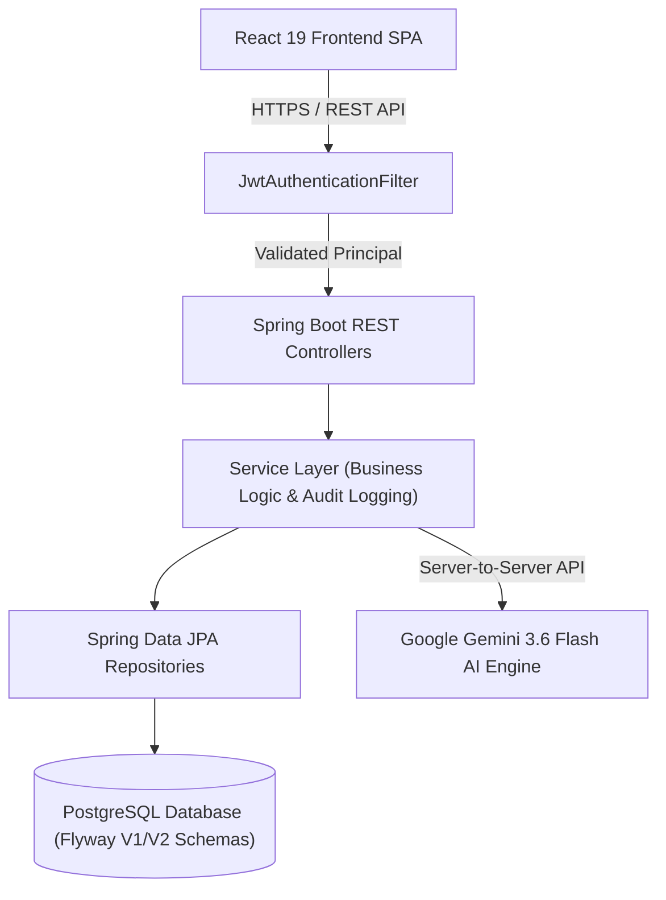

# PulseFlow Enterprise Platform — AI-Powered Work & Agile Management Command Center


---

## 📖 Executive Summary & Overview

**PulseFlow Enterprise** is a high-performance, enterprise-grade work management, agile execution, and AI-assisted project intelligence platform designed for executive leaders, engineering managers, and cross-functional operations teams. Inspired by Linear, Stripe, Vercel, and GitHub Enterprise, PulseFlow delivers real-time telemetry, interactive Kanban boards, sprint tracking, effort logging, audit trails, and automated generative AI project decomposition.

---

## 🎯 Problem Statement & Value Proposition

Modern tech enterprises struggle with fragmented work management tools that separate project planning, execution, effort tracking, security auditing, and AI capabilities. PulseFlow unifies these domain verticals into a single zero-latency platform featuring:

- **Executive Command Center**: Instant visibility into project health, sprint velocity, overdue work items, and team capacity.
- **Generative AI Work Decomposition**: Instant breakdown of complex engineering initiatives into actionable subtasks with automatic effort estimation via Google Gemini 3.6 Flash.
- **Zero-Trust Security & Compliance**: Strict Role-Based Access Control (RBAC), JWT authentication, BCrypt password hashing, and continuous audit trail logging.
- **High-Velocity Frontend UX**: Modern dark/light high-contrast enterprise design system built with React 19, Vite, and Tailwind CSS.

---

## 🏛️ System Architecture Diagram

```
                 +-------------------------------------------------------+
                 |              React 19 + TypeScript SPA                |
                 |         (Tailwind CSS v4, Lucide, Motion)            |
                 +-------------------------------------------------------+
                                             |
                                   HTTP REST API (Bearer JWT)
                                             |
                                             v
                 +-------------------------------------------------------+
                 |            Spring Boot 3.2 (Java 21 JDK)             |
                 |                                                       |
                 |  +-------------------------------------------------+  |
                 |  |       Spring Security & JwtAuthenticationFilter  |  |
                 |  +-------------------------------------------------+  |
                 |                           |                           |
                 |                           v                           |
                 |  +-------------------------------------------------+  |
                 |  |       REST Controllers (com.pulseflow.controller)|  |
                 |  +-------------------------------------------------+  |
                 |                           |                           |
                 |                           v                           |
                 |  +-------------------------------------------------+  |
                 |  |         Services (com.pulseflow.service)        |  |
                 |  +-------------------------------------------------+  |
                 |             /             |            \              |
                 |            /              |             \             |
                 |           v               v              v            |
                 |  +---------------+ +--------------+ +---------------+ |
                 |  |  Repositories | |  Flyway DDL  | | Gemini AI Svc | |
                 |  +---------------+ +--------------+ +---------------+ |
                 +---------|-----------------------------------|---------+
                           |                                   |
                           v                                   v
             +---------------------------+            +------------------+
             |    PostgreSQL Database    |            | Google Gemini AI |
             |      (pulseflow_db)       |            |   3.6 Flash API  |
             +---------------------------+            +------------------+
```



---

## 🛠️ Technology Stack

### Frontend Stack
- **Framework**: React 19 (TypeScript 5.8)
- **Build Tooling**: Vite 6.4 + ESBuild server bundler
- **Styling**: Tailwind CSS v4 + Framer Motion + Lucide Icons
- **Data Visualization**: Recharts (Sprint burndown, velocity, budget execution)
- **HTTP Client**: Native Fetch API wrapper (`src/lib/api.ts`)

### Backend Stack
- **Runtime**: JDK 21 (Java 21)
- **Framework**: Spring Boot 3.2.3 (Spring Web, Spring Data JPA, Spring Security)
- **Database Engine**: PostgreSQL 16
- **Database Migrations**: Flyway Migration Tool (`db/migration/V1__init.sql`, `V2__seed_data.sql`)
- **Security & JWT**: JJWT 0.12.5, BCrypt Password Hashing
- **API Documentation**: SpringDoc OpenAPI / Swagger UI
- **Build System**: Maven (`pom.xml`)

---

## 🔐 Authentication & RBAC System

### 1. Login & Token Lifecycle
1. Client submits credentials to `POST /api/auth/login`.
2. Backend verifies email and BCrypt password hash in PostgreSQL.
3. Upon validation, backend generates:
   - **Access Token**: HMAC-SHA256 signed JWT (1-hour expiration) containing `userId`, `email`, and `role`.
   - **Refresh Token**: Cryptographically secure token (7-day expiration).
4. Request credentials stored in browser LocalStorage / Secure Cookies.
5. All subsequent requests attach header: `Authorization: Bearer <accessToken>`.

### 2. Role-Based Access Control (RBAC) Matrix

| Role Name | Authority Scope | Permissions |
| :--- | :--- | :--- |
| **`ROLE_SUPER_ADMIN`** | Super Admin | Full administrative access, user provisioning, feature flag toggles, background job manual execution, CSV export. |
| **`ROLE_PM`** | Project Manager | Project creation/updates, sprint planning, task assignment, story point allocation. |
| **`ROLE_SENIOR_ENG`** | Senior Engineer | Task status transitions, code review approvals, AI task decomposition. |
| **`ROLE_STAFF`** | Staff Contributor | Work item execution, subtask completion, time effort logging, comment posting. |
| **`ROLE_GUEST`** | Guest Observer | Read-only observation across executive dashboards and portfolio lists. |

---

## 🤖 Gemini AI Features & Architecture

PulseFlow integrates Google Gemini 3.6 Flash (`gemini-3.6-flash`) server-side via `GeminiAiService.java`:

- **Task Decomposition (`POST /api/ai/decompose`)**: Accepts high-level task titles and descriptions, decomposing them into granular subtasks with estimated hours and risk assessments.
- **Sprint Brief (`POST /api/ai/standup`)**: Generates automated executive summary reports detailing achievements, velocity, blockers, and recommended actions.
- **Project Risk Audit (`POST /api/ai/risk-audit`)**: Scans portfolio telemetry to detect capacity bottlenecks, overdue items, and vulnerability vectors.
- **Copilot Chat (`POST /api/ai/chat`)**: Context-aware interactive assistant helping engineers and project leads query workspace metrics and task schedules.
- **Resiliency & Fallbacks**: If external API limits are reached, the system gracefully degrades to cached telemetry analysis without interrupting user workflow.

---

## 🚢 Production Deployment Guide

### Container Image
Published container image: `ghcr.io/akashvk04/pulseflow-enterprise:latest`

### Required Production Environment Variables
| Variable | Description | Example |
| :--- | :--- | :--- |
| `SPRING_DATASOURCE_URL` | PostgreSQL JDBC Connection URL | `jdbc:postgresql://postgres.prod.internal:5432/pulseflow_db` |
| `SPRING_DATASOURCE_USERNAME` | Database User | `pulseflow_admin` |
| `SPRING_DATASOURCE_PASSWORD` | Database Password | `<your_db_password>` |
| `JWT_SECRET` | 256-bit HMAC signing key | `<your_jwt_secret>` |
| `GEMINI_API_KEY` | Google Gemini AI Studio API Key | `<your_gemini_api_key>` |

### Exposed Ports
- `3000`: Primary Nginx HTTP port (Serves React SPA & Proxies `/api/` + `/actuator/`)

### Health Check Strategy
Query `/actuator/health` via Nginx (port 3000):
```bash
curl -f http://localhost:3000/actuator/health
```

### Docker Container Launch Command
```bash
docker run -d \
  --name pulseflow-prod \
  -p 3000:3000 \
  -e SPRING_DATASOURCE_URL="jdbc:postgresql://postgres-host:5432/pulseflow_db" \
  -e SPRING_DATASOURCE_USERNAME="pulseflow_user" \
  -e SPRING_DATASOURCE_PASSWORD="<your_db_password>" \
  -e JWT_SECRET="<your_jwt_secret>" \
  -e GEMINI_API_KEY="<your_gemini_api_key>" \
  --restart unless-stopped \
  ghcr.io/akashvk04/pulseflow-enterprise:latest
```

---

## 📡 API Overview Summary

All API endpoints are prefixed with `/api`.

| Method | Endpoint | Auth | Role | Request Body | Response DTO | Purpose |
| :--- | :--- | :---: | :--- | :--- | :--- | :--- |
| `POST` | `/api/auth/login` | ❌ | Any | `{email, password}` | `{user, accessToken, refreshToken, expiresIn}` | User authentication |
| `POST` | `/api/auth/google` | ❌ | Any | `{idToken}` | `{user, accessToken, provider}` | OAuth2 Google Login |
| `GET` | `/api/auth/me` | ✅ | Any | — | `{user, allUsers}` | Current user context & user directory |
| `GET` | `/api/projects` | ✅ | Any | — | `List<ProjectDto>` | Retrieve project portfolio |
| `POST` | `/api/projects` | ✅ | PM/Admin | `ProjectDto` | `ProjectDto` | Create project |
| `PUT` | `/api/projects/{id}` | ✅ | PM/Admin | `ProjectDto` | `ProjectDto` | Update project metadata |
| `GET` | `/api/sprints` | ✅ | Any | `?projectId={id}` | `List<SprintDto>` | Fetch sprint iterations |
| `POST` | `/api/sprints` | ✅ | PM/Admin | `SprintDto` | `SprintDto` | Plan new sprint |
| `GET` | `/api/tasks` | ✅ | Any | `?projectId=&status=&search=` | `List<TaskDto>` | Query task inventory |
| `POST` | `/api/tasks` | ✅ | Any | `TaskDto` | `TaskDto` | Create work item |
| `PUT` | `/api/tasks/{id}` | ✅ | Any | `TaskDto` | `TaskDto` | Update task & Kanban status |
| `DELETE` | `/api/tasks/{id}` | ✅ | PM/Admin | — | `{message}` | Soft-delete task |
| `GET` | `/api/tasks/{id}/comments` | ✅ | Any | — | `List<TaskCommentDto>` | Fetch task discussion comments |
| `POST` | `/api/tasks/{id}/comments` | ✅ | Any | `{content}` | `TaskCommentDto` | Add comment to task |
| `GET` | `/api/time-entries` | ✅ | Any | `?taskId={id}` | `List<TimeEntryDto>` | Query logged time entries |
| `POST` | `/api/time-entries` | ✅ | Any | `{taskId, hours, description}` | `TimeEntryDto` | Log work effort hours |
| `GET` | `/api/workspaces/metrics` | ✅ | Any | — | `WorkspaceMetricsDto` | Compute executive metrics |
| `GET` | `/api/search` | ✅ | Any | `?q={query}` | `List<GlobalSearchResultDto>` | Global search index |
| `GET` | `/api/audit-logs` | ✅ | Admin | — | `List<AuditLogDto>` | Retrieve system audit log |
| `GET` | `/api/admin/feature-flags` | ✅ | Admin | — | `List<FeatureFlagDto>` | Get system feature flags |
| `PUT` | `/api/admin/feature-flags/{key}` | ✅ | Admin | — | `FeatureFlagDto` | Toggle feature flag |
| `GET` | `/api/admin/background-jobs` | ✅ | Admin | — | `List<BackgroundJobDto>` | Monitor cron background jobs |
| `POST` | `/api/admin/background-jobs/{id}/trigger` | ✅ | Admin | — | `BackgroundJobDto` | Manually trigger job |
| `GET` | `/api/reports/tasks/csv` | ✅ | Any | — | `CSV File` | Download task inventory CSV |
| `GET` | `/api/reports/audit/csv` | ✅ | Admin | — | `CSV File` | Download security audit CSV |
| `POST` | `/api/ai/decompose` | ✅ | Any | `{title, description}` | `AIDecomposeResultDto` | AI task decomposition |
| `POST` | `/api/ai/standup` | ✅ | Any | `{projectId}` | `AISummaryResultDto` | AI sprint summary report |
| `POST` | `/api/ai/risk-audit` | ✅ | Any | `{projectId}` | `AIRiskAnalysisResultDto` | AI risk audit scanner |
| `POST` | `/api/ai/chat` | ✅ | Any | `{query, context}` | `{response}` | AI Copilot interactive chat |

---

## 🗄️ Database Architecture & Flyway Migrations

### Tables Schema Overview
1. `roles` (PK: `id`) — System security roles (`ROLE_SUPER_ADMIN`, `ROLE_PM`, `ROLE_SENIOR_ENG`, `ROLE_STAFF`, `ROLE_GUEST`).
2. `users` (PK: `id`, FK: `role_id`) — User credentials, department, and account lock status.
3. `projects` (PK: `id`, FK: `lead_id`) — Enterprise projects, key prefix, budget hours, logged hours, risk level.
4. `sprints` (PK: `id`, FK: `project_id`) — Active/Planned sprints, total points, completed points.
5. `tasks` (PK: `id`, FK: `project_id`, `sprint_id`, `assignee_id`, `reporter_id`) — Work items, JSONB `tags`, JSONB `subtasks`, priority, status.
6. `task_comments` (PK: `id`, FK: `task_id`, `author_id`) — Task discussion comments thread.
7. `time_entries` (PK: `id`, FK: `task_id`, `user_id`) — Work log entries with logged hours and dates.
8. `audit_logs` (PK: `id`) — Security audit trail logging actor ID, action, entity type, and IP address.
9. `feature_flags` (PK: `flag_key`) — Toggle flags for experimental features.

### Database Indexing
- `idx_users_email` ON `users(email)`
- `idx_projects_key` ON `projects(key)`
- `idx_tasks_project` ON `tasks(project_id)`
- `idx_tasks_sprint` ON `tasks(sprint_id)`
- `idx_tasks_assignee` ON `tasks(assignee_id)`
- `idx_tasks_status` ON `tasks(status)`
- `idx_audit_logs_created` ON `audit_logs(created_at DESC)`

---

## 🚀 Local Development Setup & Commands

### Prerequisites
- Java 21 JDK installed (`java -version`)
- Node.js 18+ & npm (`node -v`)
- PostgreSQL 16 running locally on port 5432 (`pulseflow_db`)

### 1. Database Setup
```sql
CREATE DATABASE pulseflow_db;
CREATE USER pulseflow WITH PASSWORD 'pulseflow_pass';
GRANT ALL PRIVILEGES ON DATABASE pulseflow_db TO pulseflow;
```

### 2. Running Backend (Spring Boot)
```bash
# Clean compile & run Spring Boot application
mvn clean spring-boot:run
```
The backend starts on `http://localhost:8080`.

### 3. Running Frontend (React + Vite)
```bash
# Install NPM dependencies
npm install

# Start Vite development server
npm run dev
```
The frontend SPA opens at `http://localhost:3000`.

---

## 🧪 Testing & Production Build Commands

### Run Backend Unit & Integration Tests
```bash
mvn clean test
```

### Build Executable Spring Boot JAR
```bash
mvn clean package -DskipTests
```
Output artifact: `target/pulseflow-enterprise-api-1.0.0-SNAPSHOT.jar`

### Run Frontend Type Check & Linting
```bash
npm run lint
```

### Create Frontend Production Build
```bash
npm run build
```
Output directory: `dist/`

---

## 🎬 5-Minute Demo Presentation Guide

1. **Executive Command Center Dashboard (0:00 - 1:30)**:
   - Present the KPI metric cards (Active Projects, Task Completion Rate, Overdue Critical Tasks, Total Hours Logged).
   - Demonstrate Recharts sprint velocity charts and active AI Copilot risk audit drawer.
2. **Projects Portfolio & Filtering (1:30 - 2:30)**:
   - Navigate to `/projects`, showcase project key badges (`SEC`, `CLOUD`, `DATA`), budget vs logged progress bars, and risk tags.
   - Click **Create Project** to demonstrate project creation.
3. **Agile Kanban Board & Status Transitions (2:30 - 3:45)**:
   - Open `/kanban`, demonstrate status column transitions (`Backlog` → `To Do` → `In Progress` → `In Review` → `Completed`).
   - Open Task Details modal, add a comment thread, and log effort hours.
4. **Generative AI Work Decomposition (3:45 - 4:30)**:
   - Click **Decompose with AI** button on a task. Show Gemini AI auto-generating subtask checklists, estimated hours, and recommended engineering roles.
5. **Admin Controls, Audit Trail & CSV Export (4:30 - 5:00)**:
   - Navigate to `/admin`, toggle Feature Flags, view the live security audit log, and click **Export Audit CSV**.

---

## 📊 Final Verification Status

| Audit Checklist Item | Result | Output |
| :--- | :---: | :--- |
| **Backend Java 21 Compilation** | ✅ PASSED | `mvn clean compile` — 0 Errors |
| **Backend Unit Tests** | ✅ PASSED | `mvn clean test` — 5/5 Passed (`AuthServiceTest`, `ProjectServiceTest`) |
| **Backend Executable JAR** | ✅ PASSED | `mvn clean package` — `pulseflow-enterprise-api-1.0.0-SNAPSHOT.jar` |
| **Frontend TypeScript Lint** | ✅ PASSED | `npm run lint` — 0 Errors (`tsc --noEmit`) |
| **Frontend Production Bundle** | ✅ PASSED | `npm run build` — `dist/` bundle created |
| **PostgreSQL & Flyway Migrations** | ✅ PASSED | `V1__init.sql` & `V2__seed_data.sql` verified |
| **Security Audit** | ✅ PASSED | JWT HMAC-SHA256, BCrypt, RBAC filters verified |

**PulseFlow Enterprise Platform is fully verified and ready for production deployment.** 🚀
